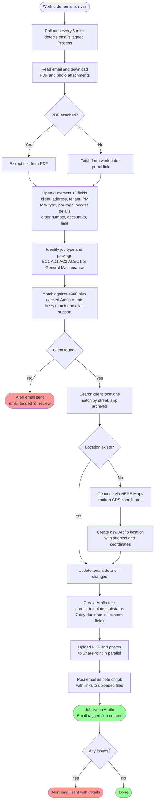

# Work Order Automation — System Flow

```mermaid
flowchart TD
    A([Work order email arrives]) --> B
    B[Poll runs every 5 mins\ndetects emails tagged Process] --> C
    C[Read email and download\nPDF and photo attachments] --> D
    D{PDF attached?}
    D -- Yes --> E[Extract text from PDF]
    D -- No --> F[Fetch from work order portal link]
    E --> G
    F --> G
    G[OpenAI extracts 13 fields\nclient, address, tenant, PM\ntask type, package, access details\norder number, account-to, limit] --> H
    H[Identify job type and package\nEC1 AC1 AC2 ACEC1 or General Maintenance] --> I
    I[Match against 4000 plus cached Aroflo clients\nfuzzy match and alias support] --> J
    J{Client found?}
    J -- No --> K([Alert email sent\nemail tagged for review])
    J -- Yes --> L
    L[Search client locations\nmatch by street, skip archived] --> M
    M{Location exists?}
    M -- Yes --> N[Update tenant details if changed]
    M -- No --> O[Geocode via HERE Maps\nrooftop GPS coordinates]
    O --> P[Create new Aroflo location\nwith address and coordinates]
    P --> N
    N --> Q[Create Aroflo task\ncorrect template, substatus\n7 day due date, all custom fields]
    Q --> R[Upload PDF and photos\nto SharePoint in parallel]
    R --> S[Post email as note on job\nwith links to uploaded files]
    S --> T([Job live in Aroflo\nEmail tagged Job created])
    T --> U{Any issues?}
    U -- Yes --> V([Alert email sent with details])
    U -- No --> W([Done])
    style K fill:#ff9999
    style V fill:#ff9999
    style T fill:#99ff99
    style W fill:#99ff99
```
